  

<h1 align="center">Hey there! I'm Ahmed Amr Alnahrawy 👋</h1>

  <strong>Freelance Data Scientist & Full-Stack Developer</strong> 
  Specializing in turning complex data into insights & building beautiful, interactive web experiences with <strong>React</strong> & <strong>Flask</strong>.

  
  
  
  
  

---

### What I Do

- **Exploratory Data Analysis & Business Insights** — Turning raw, messy data into interactive charts and actionable insights.
- **Front-End Web Design** — Crafting beautiful, responsive, and animated user interfaces using **React.js** and modern styling frameworks.
- **Full-Stack Integration** — Powering interactive interfaces with lightweight, robust backends built using **Flask** and **FastAPI**.
- **Machine Learning & AI Development** — Designing algorithms for classification, time-series forecasting, and computer vision (e.g. medical imaging).

---

### Tech Stack & Skills

<table>
  <tr>
    <td valign="top" width="50%">
      <h4> Data & AI (No deletion, only additions)</h4>
      
      
      
      
      
      
      
      
      
      
      
    </td>
    <td valign="top" width="50%">
      <h4> Front-End & Full-Stack (React & Flask)</h4>
      
      
      
      
      
      
      
      
      
      
    </td>
  </tr>
</table>

---

### Featured Projects

| Project | Tech Stack | Description |
| :--- | :--- | :--- |
| **[AI-Powered-ATS-Platform](https://github.com/Ahmed-Na7rawy/AI-Powered-ATS-Platform)** | `React` `Flask` `Python` `OCR` | Full-stack Applicant Tracking System featuring resume parsing and scoring algorithms. |
| **[time-series-sales-forecasting](https://github.com/Ahmed-Na7rawy/time-series-sales-forecasting)** | `Prophet` `ARIMA` `XGBoost` | Detailed comparisons of machine learning and statistical models for business forecasting. |
| **[Pneumonia-detector](https://github.com/Ahmed-Na7rawy/Pneumonia-detector)** | `FastAI` `Python` `GUI` | Desktop-based visual diagnostic app detecting Pneumonia from X-ray scans. |
| **[sql-python-analytics](https://github.com/Ahmed-Na7rawy/sql-python-analytics)** | `SQL` `Pandas` `Plotly` | End-to-end business intelligence pipeline processing raw SQL DB into interactive reports. |
| **[sleep-health-classifier](https://github.com/Ahmed-Na7rawy/sleep-health-classifier)** | `Scikit-learn` `Pandas` | Classifier model designed to evaluate and predict personal sleep health quality indicators. |
| **[ML-Notebooks](https://github.com/Ahmed-Na7rawy/ML-Notebooks)** | `Jupyter` `Seaborn` `Scikit-learn` | Collection of 10 applied notebooks solving real-world datasets using clean code. |

---

### GitHub Statistics & Activity

  
  

  

---

### Currently Working On & Learning

- **DermaDx** — A 6-class skin condition classifier leveraging EffNetV2 for automated dermatological diagnosis (Graduation Project).
- **Advanced Time Series Forecasting** & MLOps deployment workflows.
- Building interactive dashboard interfaces combining **React (Vite)** with **Flask RESTful APIs**.

---

  Let's connect!
   
  <b><a href="https://github.com/Ahmed-Na7rawy">GitHub Profile</a></b> • <b><a href="https://www.linkedin.com/in/ahmed-alnahrawy/">LinkedIn Profile</a></b> • <b><a href="https://www.facebook.com/Ahmed.na7rawy/">Facebook Profile</a></b> • <b><a href="https://wa.me/201018613342">WhatsApp Chat</a></b>

